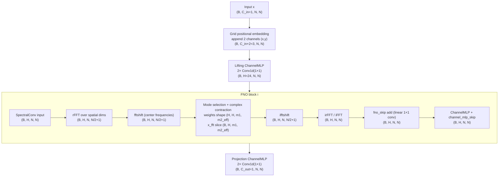

# FNO (Darcy) parameter & pipeline breakdown

This document explains how the **number of parameters (in millions)** changes with the number of Fourier layers, and breaks down each component in the FNO pipeline using the code paths in this repo.

## 1) Pipeline overview (input → output)

The FNO forward path is implemented in `neuralop/models/fno.py`:

1. **Positional embedding** (optional)  
   Code: `FNO.forward`  
   ```
   with maybe_profile(..., "fno/positional_embedding"):
       x = self.positional_embedding(x)
   ```
   - For Darcy defaults, positional embedding is `"grid"` (see `FNO.__init__`), which appends 2 grid channels (x,y).

2. **Lifting MLP**  
   Code: `FNO.__init__` creates `self.lifting = ChannelMLP(...)`  
   - Lifts from input channels → `hidden_channels` using a 2‑layer channel MLP (1×1 convs).

3. **FNO blocks (Fourier layers)** — repeated `n_layers` times  
   Code: `FNO.forward`
   ```
   for layer_idx in range(self.n_layers):
       x = self.fno_blocks(x, layer_idx, output_shape=...)
   ```
   Each block (see `neuralop/layers/fno_block.py`) includes:
   - **SpectralConv** (Fourier conv)  
     Code: `self.convs[i] = SpectralConv(...)`
   - **Skip connection** (fno_skip)  
     Code: `self.fno_skips[i] = skip_connection(..., skip_type=fno_skip)`
   - **Channel MLP** (channel_mlp)  
     Code: `self.channel_mlp[i] = ChannelMLP(...)`
   - **Channel MLP skip** (channel_mlp_skip)  
     Code: `self.channel_mlp_skips[i] = skip_connection(..., skip_type=channel_mlp_skip)`
   - Optional norms/activations (not enabled in Darcy default).

4. **Projection MLP**  
   Code: `FNO.__init__` creates `self.projection = ChannelMLP(...)`  
   - Projects `hidden_channels` → output channels (1 in Darcy default).

## 1.1) Darcy tensor dimension diagram (Mermaid)

Assume batch size **B**, spatial resolution **N×N** (Darcy default `N=16`), input channels **C_in=1**, hidden channels **H=24**, output channels **C_out=1**, and real‑valued data.



Where:
- `m2_eff = m2//2 + 1` for real inputs (from `SpectralConv.n_modes`).
- Darcy default `n_modes=[16,16]` → stored modes `[m1=16, m2_eff=9]`.

## 1.2) Navier–Stokes tensor dimension diagram (Mermaid)

Assume batch size **B**, spatial resolution **N×N** (Navier–Stokes default `N=128`), input channels **C_in=1**, hidden channels **H=64**, output channels **C_out=1**, and real‑valued data.


Where:
- `m2_eff = m2//2 + 1` for real inputs.
- Navier–Stokes default `n_modes=[64,64]` → stored modes `[m1=64, m2_eff=33]`.

## 2) What is **fno_skip** and **channel_mlp**?

### fno_skip
Defined in `neuralop/layers/skip_connections.py`.

Default for Darcy: `fno_skip="linear"` (from `config/models.py`).

`skip_connection(..., skip_type="linear")` returns `Flattened1dConv`, which is a 1×1 Conv1d on the flattened spatial dimensions:
```python
class Flattened1dConv(nn.Module):
    self.conv = nn.Conv1d(in_channels=H, out_channels=H, kernel_size=1, bias=False)
```
So **fno_skip** is a learned 1×1 linear projection on channels, applied as a residual.

### channel_mlp
Defined in `neuralop/layers/channel_mlp.py`.

It is a **channel-wise MLP** implemented as **1×1 Conv1d layers**, with a nonlinearity in between:
```python
ChannelMLP(in_channels=H, hidden_channels=round(H * channel_mlp_expansion), n_layers=2)
```
- Operates on the channel dimension at every spatial location.
- In Darcy defaults, `channel_mlp_expansion = 0.5`.

## 3) SpectralConv internals (Fourier layer)

Implemented in `neuralop/layers/spectral_convolution.py`.

Each SpectralConv does:

1. **FFT / rFFT**  
   ```
   x = torch.fft.rfftn(...)  # real data
   ```
2. **fftshift** (if order > 1)
3. **Contract selected modes** with a learnable complex weight tensor
4. **ifftshift**
5. **iFFT / irFFT**
6. **Bias add**

The weight tensor is complex:
```python
self.weight = FactorizedTensor.new(
    (in_channels, out_channels, *max_n_modes),
    dtype=torch.cfloat
)
```

For **real** data, the last Fourier dimension is halved + 1 in `SpectralConv.n_modes`:
```python
if not self.complex_data:
    n_modes[-1] = n_modes[-1] // 2 + 1
```

So if you set `n_modes=[16,16]`, the **stored** modes are `[16, 9]`.

## 4) Parameter formula vs. number of Fourier layers

Let:
- `H = hidden_channels`
- `n_layers = L`
- `n_modes = [m1, m2]`
- `m2_eff = m2//2 + 1` (real‑valued data; for complex data use `m2_eff = m2`)
- `C_in = data_channels`
- `C_out = out_channels`
- `d = spatial_dim` (2 for Darcy)
- `positional_embedding = "grid"` adds `d` channels to input
- `lift_ratio = lifting_channel_ratio`
- `proj_ratio = projection_channel_ratio`
- `mlp_exp = channel_mlp_expansion`
- **Defaults** for Darcy:  
  `H=24`, `m1=16`, `m2=16`, `C_in=1`, `C_out=1`, `d=2`, `lift_ratio=2`, `proj_ratio=2`, `mlp_exp=0.5`

### 4.1 Per‑layer parameters (one Fourier layer)

**SpectralConv weight + bias**  
Code: `neuralop/layers/spectral_convolution.py`

```
weight params = 2 * H * H * m1 * m2_eff     # complex = 2 real params
bias params   = H
```

**fno_skip (linear)**  
Code: `skip_connections.Flattened1dConv` → `Conv1d(H, H, kernel_size=1, bias=False)`
```
fno_skip params = H * H
```

**channel_mlp**  
Code: `ChannelMLP` (2 layers, Conv1d with bias)
```
h_mlp = round(H * mlp_exp)
channel_mlp params = (H * h_mlp + h_mlp) + (h_mlp * H + H)
                   = 2 * H * h_mlp + h_mlp + H
```

**channel_mlp_skip (soft-gating)**  
Code: `skip_connections.SoftGating`
```
channel_mlp_skip params = H   # weight only, bias=False by default
```

**Norms**  
Default Darcy uses `norm=None`, so **0 params**.

**Per‑layer total**  
```
layer_params =
  (2 * H * H * m1 * m2_eff + H)         # SpectralConv
  + (H * H)                             # fno_skip
  + (2 * H * h_mlp + h_mlp + H)         # channel_mlp
  + (H)                                 # channel_mlp_skip
```

### 4.2 Lifting MLP

Code: `FNO.__init__` uses `ChannelMLP` with 2 layers.

Input channels:  
```
lift_in = C_in + d  # grid positional embedding adds d channels
lift_hidden = round(lift_ratio * H)
```

Parameters:
```
lifting_params =
  (lift_in * lift_hidden + lift_hidden) +
  (lift_hidden * H + H)
```

### 4.3 Projection MLP

Code: `FNO.__init__` uses `ChannelMLP` with 2 layers.

```
proj_hidden = round(proj_ratio * H)

projection_params =
  (H * proj_hidden + proj_hidden) +
  (proj_hidden * C_out + C_out)
```

### 4.4 Total parameters and scaling with `n_layers`

```
total_params =
  lifting_params +
  projection_params +
  L * layer_params
```

So **the parameter count grows linearly with the number of Fourier layers** (L).  
Only lifting + projection are fixed offsets.

## 5) Darcy default: numeric values (in millions)

Defaults (from `config/models.py` → `FNO_Small2d`):

```
H=24, n_modes=[16,16], C_in=1, C_out=1, d=2,
lift_ratio=2, proj_ratio=2, mlp_exp=0.5, L=4
m2_eff = 16//2 + 1 = 9
h_mlp = round(24 * 0.5) = 12
```

### Per‑layer
```
SpectralConv = 2 * 24 * 24 * 16 * 9 + 24 = 165,912
fno_skip     = 24 * 24                 =     576
channel_mlp  = 2 * 24 * 12 + 12 + 24   =     612
mlp_skip     = 24                       =      24

layer_total  = 167,124 params  ≈ 0.167M
```

### Lifting
```
lift_in=3, lift_hidden=48
lifting_params = (3*48+48) + (48*24+24) = 1,368
```

### Projection
```
proj_hidden=48
projection_params = (24*48+48) + (48*1+1) = 1,249
```

### Total with L layers
```
total_params = 1,368 + 1,249 + L * 167,124

L=4  => 671,113 params ≈ 0.671M
L=6  => 1,005,361 params ≈ 1.005M
L=8  => 1,339,609 params ≈ 1.340M
```

## 6) Where the values come from (code pointers)

| Component | Code path | Key values for Darcy |
|---|---|---|
| Model config | `config/models.py` → `FNO_Small2d` | `n_modes=[16,16]`, `hidden_channels=24`, `n_layers=4` |
| Forward pipeline | `neuralop/models/fno.py` | `self.lifting → self.fno_blocks → self.projection` |
| Fourier layer | `neuralop/layers/spectral_convolution.py` | FFT, contract, iFFT |
| FNO block | `neuralop/layers/fno_block.py` | convs, skips, channel_mlp |
| fno_skip | `neuralop/layers/skip_connections.py` | `Flattened1dConv` for `"linear"` |
| channel_mlp | `neuralop/layers/channel_mlp.py` | 2× Conv1d(1×1) + GELU |

---

If you change `n_layers`, you only scale the **per‑layer** term.  
If you change `hidden_channels` or `n_modes`, the SpectralConv term dominates and grows quickly.
