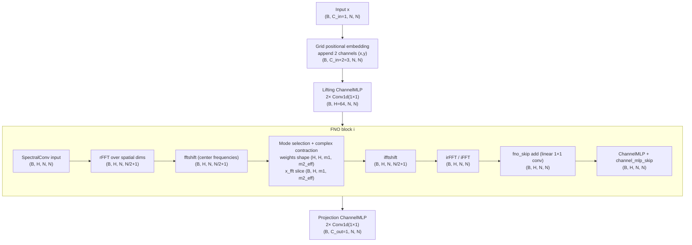

# FNO (Navier–Stokes) parameter & pipeline breakdown

This document breaks down the **parameter counts (in millions)** for the Navier–Stokes default config and shows a full tensor‑shape pipeline diagram.

## 1) Pipeline overview (input → output)

The FNO forward path is implemented in `neuralop/models/fno.py`:

1. **Positional embedding** (optional)  
   Code: `FNO.forward`
   ```
   x = self.positional_embedding(x)
   ```
   - Default is `"grid"`, which appends 2 grid channels (x,y).

2. **Lifting MLP**  
   Code: `FNO.__init__` creates `self.lifting = ChannelMLP(...)`  
   - Lifts input channels → `hidden_channels` with 2× 1×1 Conv1d layers.

3. **FNO blocks (Fourier layers)** — repeated `n_layers` times  
   Code: `FNO.forward`
   ```
   for layer_idx in range(self.n_layers):
       x = self.fno_blocks(x, layer_idx, ...)
   ```
   Each block (see `neuralop/layers/fno_block.py`) includes:
   - **SpectralConv** (Fourier convolution)
   - **fno_skip** (skip connection)
   - **Channel MLP** (channel_mlp)
   - **channel_mlp_skip** (skip)

4. **Projection MLP**  
   Code: `FNO.__init__` creates `self.projection = ChannelMLP(...)`  
   - Projects `hidden_channels` → output channels.

## 1.1) Navier–Stokes tensor dimension diagram (Mermaid)

Assume batch size **B**, spatial resolution **N×N** (default `N=128`), input channels **C_in=1**, hidden channels **H=64**, output channels **C_out=1**, and real‑valued data.



Where:
- `m2_eff = m2//2 + 1` for real inputs.
- Navier–Stokes default `n_modes=[64,64]` → stored modes `[m1=64, m2_eff=33]`.

## 2) Parameter formulas and scaling with `n_layers`

Let:
- `H = hidden_channels`
- `n_layers = L`
- `n_modes = [m1, m2]`
- `m2_eff = m2//2 + 1` (real‑valued data)
- `C_in = data_channels`
- `C_out = out_channels`
- `d = spatial_dim` (2 for Navier–Stokes)
- `positional_embedding = "grid"` adds `d` channels
- `lift_ratio = lifting_channel_ratio`
- `proj_ratio = projection_channel_ratio`
- `mlp_exp = channel_mlp_expansion`

### 2.1 Per‑layer parameters (one Fourier layer)

**SpectralConv weight + bias**  
```
weight params = 2 * H * H * m1 * m2_eff
bias params   = H
```

**fno_skip (linear)**  
```
fno_skip params = H * H
```

**channel_mlp** (2 layers, bias=True)  
```
h_mlp = round(H * mlp_exp)
channel_mlp params = 2 * H * h_mlp + h_mlp + H
```

**channel_mlp_skip** (soft‑gating)  
```
channel_mlp_skip params = H
```

**Per‑layer total**  
```
layer_params =
  (2 * H * H * m1 * m2_eff + H)  # SpectralConv
  + (H * H)                       # fno_skip
  + (2 * H * h_mlp + h_mlp + H)   # channel_mlp
  + (H)                           # channel_mlp_skip
```

### 2.2 Lifting MLP

```
lift_in = C_in + d
lift_hidden = round(lift_ratio * H)

lifting_params =
  (lift_in * lift_hidden + lift_hidden) +
  (lift_hidden * H + H)
```

### 2.3 Projection MLP

```
proj_hidden = round(proj_ratio * H)

projection_params =
  (H * proj_hidden + proj_hidden) +
  (proj_hidden * C_out + C_out)
```

### 2.4 Total parameters

```
total_params =
  lifting_params +
  projection_params +
  L * layer_params
```

So **parameter count grows linearly with the number of Fourier layers** (L).

## 3) Navier–Stokes default numeric breakdown

Defaults (from `config/models.py` → `FNO_Medium2d`):

```
H=64, n_modes=[64,64], C_in=1, C_out=1, d=2,
lift_ratio=2, proj_ratio=4, mlp_exp=0.5, L=4
m2_eff = 64//2 + 1 = 33
h_mlp = round(64 * 0.5) = 32
```

### Per‑layer
```
SpectralConv = 2 * 64 * 64 * 64 * 33 + 64 = 17,301,568
fno_skip     = 64 * 64                      =     4,096
channel_mlp  = 2 * 64 * 32 + 32 + 64        =     4,192
mlp_skip     = 64                            =        64

layer_total  = 17,309,920 params ≈ 17.31M
```

### Lifting
```
lift_in=3, lift_hidden=128
lifting_params = (3*128+128) + (128*64+64) = 8,768
```

### Projection
```
proj_hidden=256
projection_params = (64*256+256) + (256*1+1) = 16,897
```

### Total with L layers
```
total_params = 8,768 + 16,897 + L * 17,309,920

L=4  => 69,265,345 params ≈ 69.27M
L=6  => 103,885,185 params ≈ 103.89M
L=8  => 138,505,025 params ≈ 138.51M
```

## 4) Code pointers for values

| Component | Code path | Navier–Stokes defaults |
|---|---|---|
| Model config | `config/navier_stokes_config.py` → `FNO_Medium2d` | `n_modes=[64,64]`, `hidden_channels=64`, `n_layers=4` |
| Forward pipeline | `neuralop/models/fno.py` | `self.lifting → self.fno_blocks → self.projection` |
| Fourier layer | `neuralop/layers/spectral_convolution.py` | FFT/contract/iFFT |
| FNO block | `neuralop/layers/fno_block.py` | convs, skips, channel_mlp |
| fno_skip | `neuralop/layers/skip_connections.py` | `Flattened1dConv` for `"linear"` |
| channel_mlp | `neuralop/layers/channel_mlp.py` | 2× Conv1d(1×1) + GELU |
